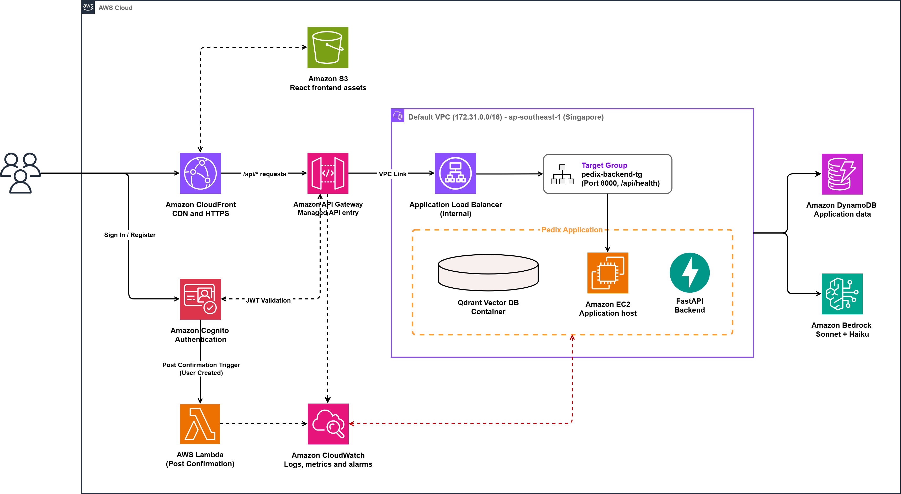

# Pedix

> **AI-Powered Pediatric Health Navigator** — A multi-stage Retrieval-Augmented Generation (RAG) assistant that helps parents and caregivers navigate pediatric health concerns using evidence-based clinical guidelines from WHO and NICE.


---

## 🌐 Live Deployment

| | URL |
|---|---|
| **Frontend** | https://d2bx3usq72976a.cloudfront.net |
| **API Health** | https://96hnl890q4.execute-api.ap-southeast-1.amazonaws.com/prod/api/health |

---

## 🏗 Architecture



The production system runs entirely on AWS Free Tier services in `ap-southeast-1` (Singapore):

- **CloudFront + S3** serve the React frontend with HTTPS globally
- **API Gateway** (REST + SSE streaming) handles all `/api/*` traffic with Cognito JWT authorization
- **Internal ALB + VPC Link** routes API Gateway requests securely into the Default VPC
- **EC2 (t2.micro)** hosts the FastAPI backend and Qdrant vector database
- **DynamoDB** stores conversation sessions, user profiles, and analytics
- **Amazon Bedrock** (Claude Haiku) powers the multi-stage agentic reasoning pipeline
- **Cognito** handles user authentication with post-confirmation Lambda auto-group assignment

> For full cloud infrastructure details, resource IDs, and design decisions, see [`docs/cloud_setup.md`](docs/cloud_setup.md).

---

## 📋 Table of Contents

1. [Prerequisites](#-prerequisites)
2. [Step 1: Environment Configuration](#️-step-1-environment-configuration)
3. [Step 2: Start Qdrant (Vector Database)](#-step-2-start-qdrant-vector-database)
4. [Step 3: Run Data Ingestion](#-step-3-run-data-ingestion)
5. [Step 4: Start Backend](#️-step-4-start-backend)
6. [Step 5: Start Frontend](#-step-5-start-frontend)
7. [Running Tests & Evaluation](#-running-tests--evaluation)
8. [Documentation](#-documentation)

---

## 📌 Prerequisites

Before you begin, ensure you have the following installed:

- **Python 3.11+**
- **Node.js 20+**
- **Docker Desktop** — required for the Qdrant vector database
- **AWS CLI** (`pip install awscli`) — configured with credentials that have access to Amazon Bedrock, DynamoDB, and Cognito

---

## 🛠️ Step 1: Environment Configuration

```bash
# Copy the example environment file
cp .env.example .env
```

Open `.env` and fill in your AWS credentials and service identifiers. Refer to [docs/setup.md](docs/setup.md) for instructions on locating each value, including Bedrock inference profile IDs and Cognito pool IDs.

---

## 🐳 Step 2: Start Qdrant (Vector Database)

Qdrant stores and queries the vectorised medical knowledge base.

```bash
# Start the Qdrant container in the background
docker compose up -d

# Verify Qdrant is running
curl http://localhost:6333/healthz
```

---

## 🧠 Step 3: Run Data Ingestion

Ingest the medical knowledge base into Qdrant before starting the backend. Ensure Docker (Qdrant) is running and `.env` is fully configured.

```bash
# Navigate to the ingestion directory
cd ingestion

# Create and activate a virtual environment
python -m venv venv
venv\Scripts\activate      # Windows
# source venv/bin/activate  # macOS/Linux

# Install PyTorch CPU-only (avoids heavy GPU downloads)
pip install torch --index-url https://download.pytorch.org/whl/cpu

# Install ingestion dependencies
pip install -r requirements.txt
```

### Batch Ingestion (Recommended)

```bash
# Windows — ingests 7 core medical documents with Contextual Retrieval
run_ingestion.bat

# macOS/Linux — run manually or adapt to a shell script:
# python run_ingestion.py --file data/fever_under_5s.md --source NICE
# ... (see run_ingestion.bat for the full file list)
```

> If AWS rate limits are hit, the script automatically pauses 60 seconds and retries (up to 7 times).

### Large File (Separate Step)

`hospital_care_for_children.md` is significantly larger and is intentionally excluded from the batch script. Run it separately:

```bash
# With Contextual Retrieval (slower, uses Bedrock Haiku):
python run_ingestion.py --file data/hospital_care_for_children.md --source WHO

# Without Contextual Retrieval (faster, lower Bedrock cost):
python run_ingestion.py --file data/hospital_care_for_children.md --source WHO --skip-context
```

---

## ⚙️ Step 4: Start Backend

Open a **new terminal window**:

```bash
# Navigate to the backend directory
cd backend

# Create and activate a virtual environment (separate from ingestion)
python -m venv venv
venv\Scripts\activate      # Windows
# source venv/bin/activate  # macOS/Linux

# Install PyTorch CPU-only first
pip install torch --index-url https://download.pytorch.org/whl/cpu

# Install backend dependencies
pip install -r requirements.txt

# Start the FastAPI server
uvicorn main:app --reload --host 0.0.0.0 --port 8000
```

> **Verify:** Open `http://localhost:8000/api/health` — should return `{"status":"ok","service":"pedix-backend"}`

> **⚠️ Always use `--workers 1`:** The SSE streaming endpoint relies on an in-memory `PendingRequestStore` that is not shared across OS processes. Using `--workers 2+` will cause `Request ID expired or not found` errors for streaming responses.

---

## 💻 Step 5: Start Frontend

Open another **new terminal window**:

```bash
# Navigate to the frontend directory
cd frontend

# Install Node.js dependencies
npm install

# Start the Vite development server
npm run dev
```

> **View App:** Open `http://localhost:5173`

---

## 🧪 Running Tests & Evaluation

### Unit Tests

```bash
# Inside the backend directory with the virtual environment activated
pytest tests/ -v
```

### RAG & Clinical Reasoning Evaluation Benchmark

The evaluation harness evaluates **Retrieval Quality** (Hit@1, Hit@K, Mean Rerank Score, Age Filter Compliance) and **Clinical Urgency Accuracy** (ESI v4 Exact Match, Adjacent Match, Critical Safety Misses) across 25 pediatric clinical testcases ([`scripts/eval_data/rag_testcases.json`](scripts/eval_data/rag_testcases.json)).

Ensure Docker (Qdrant) is running and your virtual environment is activated:

```bash
# 1. Full Evaluation (Retrieval + Stage 0 Safety Screen + Stage 3 Bedrock Reasoner)
python scripts/eval_rag.py

# 2. Fast Evaluation (Retrieval-Only — skips Bedrock LLM calls for speed and cost saving)
python scripts/eval_rag.py --retrieval-only

# 3. Custom Evaluation (Custom Top-K or Output JSON Path)
python scripts/eval_rag.py --top-k 5 --output scripts/eval_results/custom_run.json
```

> **Evaluation Results:** Detailed JSON reports with full metrics and per-case breakdowns are saved automatically to `scripts/eval_results/eval_<timestamp>.json`.

---

## 📁 Documentation

| Document | Description |
|---|---|
| [`docs/setup.md`](docs/setup.md) | Detailed local dev setup + AWS IAM, Cognito, DynamoDB, and Bedrock configuration |
| [`docs/cloud_setup.md`](docs/cloud_setup.md) | Deployed cloud infrastructure — live resource IDs, architecture, security, and cost breakdown |
| [`docs/Pedix-architecture.drawio.png`](docs/Pedix-architecture.drawio.png) | Full AWS architecture diagram |
